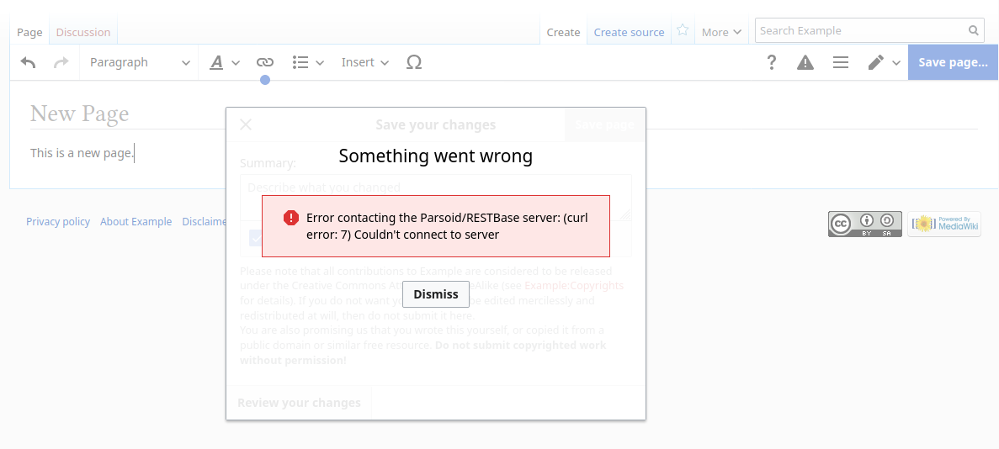

# Example configurations for Mediawiki and Docker Compose

All examples are based on the (unofficial) [Mediawiki 1.35.x](https://hub.docker.com/_/mediawiki) Docker Compose example.

For Apache and Nginx.

Additional configurations:

* [VisualEditor/Parsoid URL](#visualeditorparsoid-url)
* [Short URL](#short-url)
* [Additional Composer dependencies](#additional-dependencies)

## VisualEditor/Parsoid URL
If you use the default Docker Compose example without any additional changes, then you will see the following error when saving a page using VisualEditor:

    Something went wrong

    Error contacting the Parsoid/RESTBase server: (curl error: 7) Couldn't connect to server

The solution is to add the following to your `LocalSettings.php`:

    $wgVirtualRestConfig['modules']['parsoid'] = [
        'url' => 'http://mediawiki:80/rest.php',
    ];
    wfLoadExtension( 'Parsoid', 'vendor/wikimedia/parsoid/extension.json' );

In the URL, the `mediawiki` domain refers to the name of the `mediawiki` service in `docker-compose.yml`.

The reason for this error is within the `mediawiki` container the implicit default value will be "http://localhost:8080/rest.php".
However, that default URL does not resolve from inside that container, so instead the URL must be overriden to refer to the hostname and port visible in that container.

As per the [VisualEditor/Parsoid documentation](https://www.mediawiki.org/wiki/Extension:VisualEditor#Linking_with_Parsoid) the extension has to be loaded explicitly because the configuration was overriden.

## Short URL
Add the following to `LocalSettings.php` to enable the defaut short URLs:

    $wgArticlePath = "/$1";

The default Apache rewrite rules rewrite the entire URL to just the page title.
Example:
`http://localhost:8080/index.php/Main_Page`
becomes
`http://localhost:8080/Main_Page`

## Additional Composer dependencies

Additional dependencies can be installed using a custom image and Composer 1.

Custom image specifying dependencies: [Dockerfile](apache/Dockerfile)
Versions: [composer.local.json](apache/composer.local.json)
